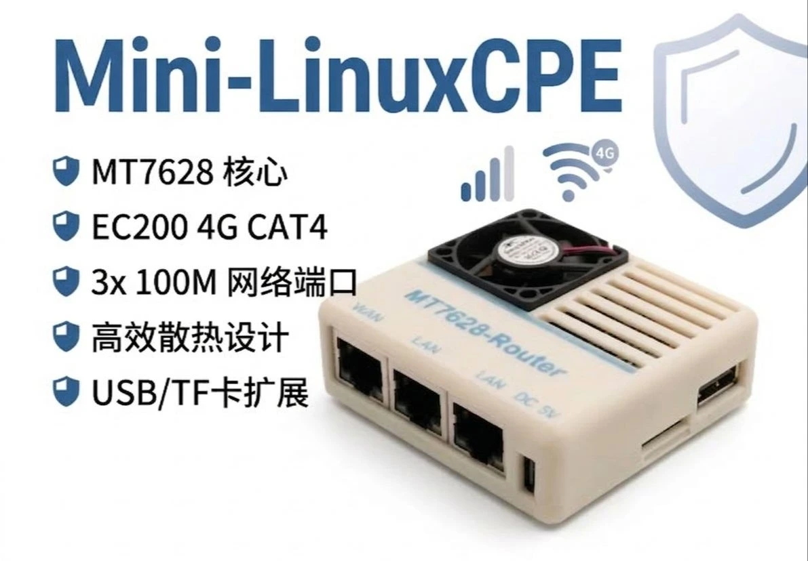

[简体中文](README.md) | [English](README_en.md)

# MiniLinux-CPE OpenWRT Console

`yang-cpe-console` is device control software for MiniLinux-CPE (MT7628, ImmortalWrt 25.12,
Linux 6.12). It provides a modern LuCI graphical interface and
a serial/SSH command line. The backend uses only BusyBox/ash and native OpenWrt tools, without
Python, Node.js or ncurses.

## Supporting hardware



The image shows the Mini-LinuxCPE router used with this console.

[Hardware project and image source](https://oshwhub.com/jasonyang17/project_bkczwwfp)

## Features

- Check the status and complete the configuration on the "Service → MiniLinux CPE" page of LuCI.
- The dashboard provides circular gauges for CPU, memory, storage, fan, Wi-Fi, and Ethernet ports.
- Sample and plot CPU/memory trends versus LAN/4G real-time traffic every 3 seconds.
- Use the web slider to set the GPIO46 fan PWM in the range 0–255.
- Displays CPU frequency, load, temperature and runtime.
- Display memory, disk/TF card, USB storage status.
- Displays MT7628 switch port, LAN/WAN address and wireless status.
- Detect USB, AT, QMI/MBIM devices of EC200.
- Query SIM status, signal strength, registration, network technology, and QMI/MBIM connection status.
- Configure QMI/MBIM/NCM, APN, PIN, PDP, authentication and auto/GSM/LTE modes.
- Allow sending custom EC200 instructions starting with `AT` and reject control characters.

## Usage

```sh
cpectl
cpectl dashboard
cpectl fan status
cpectl fan 128
cpectl ec200 status
cpectl ec200 at 'AT+CSQ'
cpectl ec200 set apn cmnet
cpectl ec200 set proto qmi
cpectl ec200 set network_mode lte
cpectl ec200 apply
```

EC200 settings are stored in `/etc/config/ec200`. Running `cpectl ec200 apply` updates
the UCI network interface and reconnects it; remote access may be briefly interrupted.

Configurable keys: `proto`, `at_port`, `data_device`, `interface`, `apn`, `pin`,
`pdptype`、`auth`、`username`、`password`、`network_mode`。

## Installation

ImmortalWrt 25.12 uses APK packages and cannot install traditional IPKs. On this repository's
**Actions** page, download the `luci-app-yang-cpe-console-1.1.0-ramips-mt76x8`
artifact, upload both APKs to the device, and run:

```sh
apk add --allow-untrusted /tmp/yang-cpe-console-1.1.0-r1.apk
apk add --allow-untrusted /tmp/luci-app-yang-cpe-console-*.apk
```

Log in again or refresh LuCI, then open **Services → MiniLinux CPE**. The interface includes
system, disk, Ethernet, and wireless status panels, a fan PWM slider, an EC200 configuration form, detailed status, and
a custom AT command input.

This software package depends on `ubus`, `uci`, `jsonfilter`, `iwinfo`, `swconfig`,
`block-mount`, `usbutils`, `uqmi`, and `umbim`. The target firmware should also include the EC200
USB serial, QMI/MBIM/NCM kernel drivers, and `fanctl`.

## CI build

GitHub Actions uses the following pinned settings:

- ImmortalWrt branch: `openwrt-25.12`
- Source commit: `3a0f609352e0b582fc670af865ad449a65b18e62`
- Target: `ramips/mt76x8`, `hilink_hlk-7628n`

Changes to `Makefile`, `ci.config`, `files/`, `luci-app/`, or the workflow trigger a build. You can also
run **Build MiniLinux-CPE console APK** manually on the Actions page.
